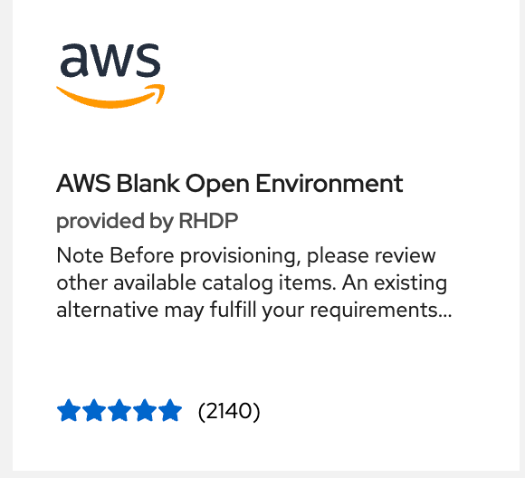
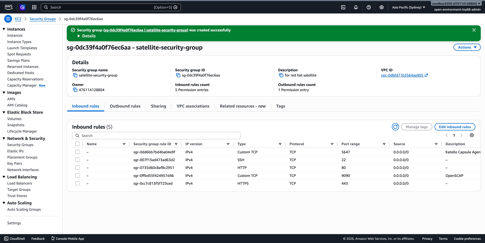
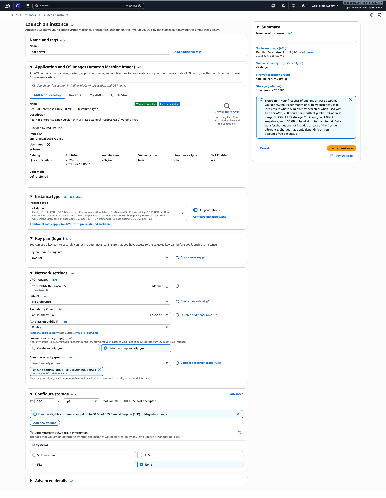

# Environment Setup & Proxy Rules

## Environment Preparation (Phase 0)

This section details the foundational deployment steps required to provision the cloud infrastructure and configure the underlying operating system environment prior to installing Red Hat Satellite 6.19.

***

### 1. Cloud Infrastructure Provisioning

#### 1.1 Sandbox Account Allocation

The infrastructure sandbox is spawned utilizing the **Red Hat Demo Platform (RHDP)** to guarantee an isolated cloud ledger with adequate administrative privileges.

* **Catalog Item:** `AWS Blank Open Environment`

<figure><figcaption></figcaption></figure>

#### 1.2 Firewall & Network Security Group Blueprint

A custom network security profile must be constructed to open specific ingress ports. This architecture allows administrative system control, client host configuration delivery, and advanced compliance reporting checks across multiple subnets.

* **Security Group Name:** `satellite-security-group`
* **VPC Association:** Default Sandbox VPC&#x20;

| Type           | Protocol | Port Range | Source      | Description / Purpose                         |
| -------------- | -------- | ---------- | ----------- | --------------------------------------------- |
| **SSH**        | TCP      | `22`       | `0.0.0.0/0` | Secure Backend Remote Administration          |
| **HTTP**       | TCP      | `80`       | `0.0.0.0/0` | Client Registration Bootstrap Script Delivery |
| **HTTPS**      | TCP      | `443`      | `0.0.0.0/0` | Web Management UI & Client Registration API   |
| **Custom TCP** | TCP      | `5647`     | `0.0.0.0/0` | Katello Capsule Remote Agent Communication    |
| **Custom TCP** | TCP      | `9090`     | `0.0.0.0/0` | Cockpit Web Console & OpenSCAP CIS Compliance |

<figure><figcaption></figcaption></figure>

#### 1.3 Compute Instance Sizing (`sat-server`)

The Satellite platform demands a memory-heavy hardware footprint to smoothly host its nested PostgreSQL, Tomcat, and Pulp caching engines. The EC2 node allocation adheres to official Red Hat hardware pre-requisites:

* **Name / Tag:** `sat-server`
* **Instance Type:** `r5.xlarge` (4 vCPUs, 32 GiB RAM minimum)
* **Operating System AMI:** Red Hat Enterprise Linux 9 (HVM), SSD Volume Type \[[link](https://docs.redhat.com/en/documentation/red_hat_satellite/6.19/html-single/installing_satellite_server_in_a_connected_network_environment/index#operating-system-requirements)]
* **Storage Footprint:** `250 GiB` GP3 Root Block Device mounted to `/`
* **Security Subsystem:** Attached to `satellite-security-group`&#x20;

<figure><figcaption></figcaption></figure>

***

### 2. Operating System Baseline Adjustments

With the instance initialized and reachable via SSH, the underlying operating system environment must be tuned and isolated from cloud-provider software mirrors.

#### 2.1 Immutable FQDN Assignment

Red Hat Satellite uses an internal cryptographic certificate authority (CA) that ties directly to the server's local hostname. A static Fully Qualified Domain Name (FQDN) must be set.

Because modifying core system configurations requires elevated privileges, administrative shells must be escalated to raw `root` execution block parameters to satisfy terminal redirection operators:

```bash
# 1. Update the system identity variables via standard shell
sudo hostnamectl set-hostname satellite.lab.local

# 2. Elevate to root administrative shell to bypass redirection tracking blocks
sudo -i

# 3. Append the static resolution hook to the system hosts table
echo "127.0.0.1 satellite.lab.local satellite" >> /etc/hosts

# 4. Cycle system power to apply FQDN changes across all kernel and systemd layers
reboot
```
