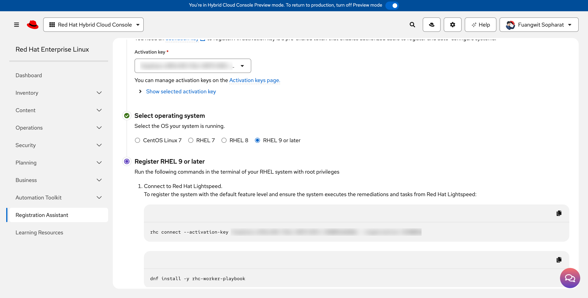
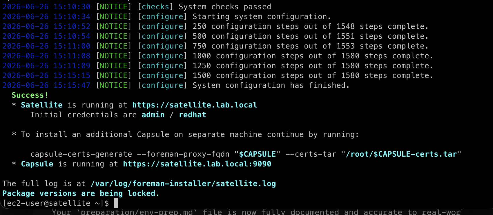
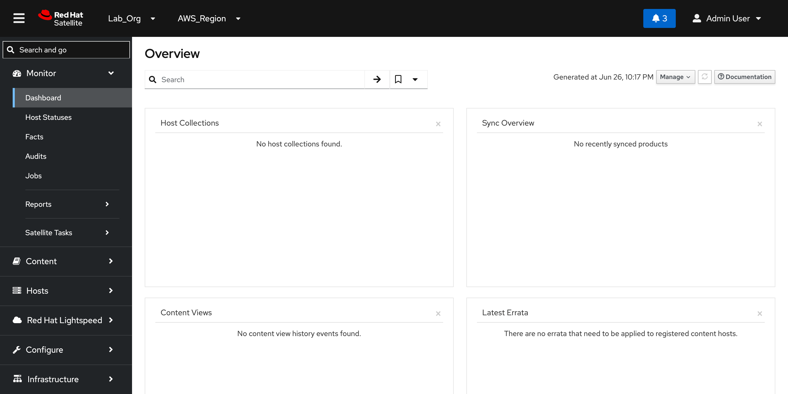
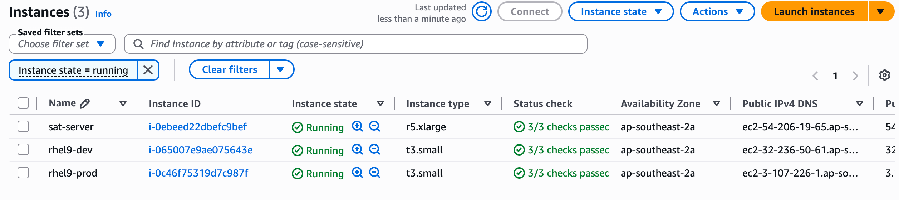

# Environment Setup & Proxy Rules

## Environment Preparation (Phase 0)

This section details the foundational deployment steps required to provision the cloud infrastructure and configure the underlying operating system environment prior to [installing Red Hat Satellite 6.19](https://docs.redhat.com/en/documentation/red_hat_satellite/6.19/html-single/installing_satellite_server_in_a_connected_network_environment/index).

***

### 1. Cloud Infrastructure Provisioning

#### 1.1 Sandbox Account Allocation

The infrastructure sandbox is spawned utilizing the **Red Hat Demo Platform (RHDP)** to guarantee an isolated cloud ledger with adequate administrative privileges.

* **Catalog Item:** `AWS Blank Open Environment`

<figure><figcaption></figcaption></figure>

#### 1.2 Firewall & Network Security Group Blueprint

A custom network security profile must be constructed to open specific ingress ports. This architecture allows administrative system control, client host configuration delivery, and advanced compliance reporting checks across multiple subnets.

* **Security Group Name:** `satellite-security-group`
* **VPC Association:** Default Sandbox VPC&#x20;

| Type           | Protocol | Port Range | Source      | Description / Purpose                         |
| -------------- | -------- | ---------- | ----------- | --------------------------------------------- |
| **SSH**        | TCP      | `22`       | `0.0.0.0/0` | Secure Backend Remote Administration          |
| **HTTP**       | TCP      | `80`       | `0.0.0.0/0` | Client Registration Bootstrap Script Delivery |
| **HTTPS**      | TCP      | `443`      | `0.0.0.0/0` | Web Management UI & Client Registration API   |
| **Custom TCP** | TCP      | `5647`     | `0.0.0.0/0` | Katello Capsule Remote Agent Communication    |
| **Custom TCP** | TCP      | `9090`     | `0.0.0.0/0` | Cockpit Web Console & OpenSCAP CIS Compliance |

<figure><figcaption></figcaption></figure>

#### 1.3 Compute Instance Sizing (`sat-server`)

The Satellite platform demands a memory-heavy hardware footprint to smoothly host its nested PostgreSQL, Tomcat, and Pulp caching engines. The EC2 node allocation adheres to official Red Hat hardware pre-requisites:

* **Name / Tag:** `sat-server`
* **Instance Type:** `r5.xlarge` (4 vCPUs, 32 GiB RAM minimum)
* **Operating System AMI:** Red Hat Enterprise Linux 9 (HVM), SSD Volume Type \[[link](https://docs.redhat.com/en/documentation/red_hat_satellite/6.19/html-single/installing_satellite_server_in_a_connected_network_environment/index#operating-system-requirements)]
* **Storage Footprint:** `250 GiB` GP3 Root Block Device mounted to `/`
* **Security Subsystem:** Attached to `satellite-security-group`&#x20;

<figure><figcaption></figcaption></figure>

***

### 2. Operating System Baseline Adjustments

With the instance initialized and reachable via SSH, the underlying operating system environment must be tuned and isolated from cloud-provider software mirrors.

#### 2.1 Immutable FQDN Assignment

Red Hat Satellite uses an internal cryptographic certificate authority (CA) that ties directly to the server's local hostname. A static Fully Qualified Domain Name (FQDN) must be set.

Because modifying core system configurations requires elevated privileges, administrative shells must be escalated to raw `root` execution block parameters to satisfy terminal redirection operators:

```bash
# 1. Update the system identity variables via standard shell
sudo hostnamectl set-hostname satellite.lab.local

# 2. Elevate to root administrative shell to bypass redirection tracking blocks
sudo -i

# 3. Append the static resolution hook to the system hosts table
PRIVATE_IP=$(hostname -I | awk '{print $1}')
echo "$PRIVATE_IP satellite.lab.local satellite" >> /etc/hosts

# 4. Cycle system power to apply FQDN changes across all kernel and systemd layers
reboot
```

**Verification Milestone**

Following the system restart loop, verify that the host identity returns the proper domain format:

```
hostname -f
# Expected Output: satellite.lab.local
```

#### 2.2 AWS RHUI Decoupling (Cloud Mirror Purge)

Standard AWS RHEL cloud images are hardcoded to check AWS-managed internal repositories (Red Hat Update Infrastructure - RHUI). To protect against package contamination, repository locks, and update stream cross-talk, these cloud provider configuration configurations must be purged completely:

```
# 1. Gain root administrative privileges
sudo -i

# 2. Establish a secure archive backup container directory
mkdir -p /etc/yum.repos.d/rhui-bak

# 3. Isolate the default cloud-provider repo records out of the runtime path
mv /etc/yum.repos.d/redhat-rhui* /etc/yum.repos.d/rhui-bak/

# 4. Force a comprehensive clear down of the package manager tracking cache
dnf clean all
rm -rf /var/cache/dnf
```

**Verification Milestone**

To confirm that the package manager is completely isolated and blank, run a inventory repolist check:

```
dnf repolist
```

_Expected Output Terminal Messages:_

```
Updating Subscription Management repositories.
Unable to read consumer identity
This system is not registered with an entitlement server. You can use "rhc" or "subscription-manager" to register.
No repositories available
```

#### 2.4 Red Hat Cloud Connectivity & CDN Registration

Rather than using legacy, interactive service credentials, the host platform uses **Red Hat Connect (`rhc`)** to securely register the system against a pre-shared Cloud Activation Key via the [Hybrid Cloud Console Registration Assistant](https://console.redhat.com/insights/registration).

<figure><figcaption></figcaption></figure>

Execute the automation connect command directly from an elevated administrative shell:

```bash
# 1. Connect the host platform and assign cloud entitlements automatically
sudo rhc connect --activation-key <YOUR_CLOUD_ACTIVATION_KEY>

# 2. Install the compliance worker engine for remote task orchestration
sudo dnf install -y rhc-worker-playbook
```

**Verification Milestone**

Verify that the host can reach the Red Hat Content Delivery Network (CDN) and list the basic enterprise update tracks:

```bash
sudo dnf repolist
```

expected output:

```
Updating Subscription Management repositories.
repo id                                    repo name
rhel-9-for-x86_64-appstream-rpms           Red Hat Enterprise Linux 9 for x86_64 - AppStream (RPMs)
rhel-9-for-x86_64-baseos-rpms              Red Hat Enterprise Linux 9 for x86_64 - BaseOS (RPMs)
```

#### 2.5 Enabling Satellite Installation Repositories

With the base enterprise channels online, the specific product delivery and maintenance channels required to extract the Satellite 6.19 installer metadata must be enabled via the subscription subsystem.

Execute the channel attachment command:

```bash
sudo subscription-manager repos \
  --enable="satellite-6.19-for-rhel-9-x86_64-rpms" \
  --enable="satellite-maintenance-6.19-for-rhel-9-x86_64-rpms"
```

#### 2.6 Installing Core Satellite Framework Packages

Once the channels are synchronized, download the core `satellite` metadata installation binaries and underlying system dependencies directly from the Red Hat Content Delivery Network (CDN):

```bash
sudo dnf install -y satellite
```

#### 2.7 Platform Installation Execution

With the network layout, operating system parameters, and software tracks verified, launch the non-interactive `satellite-installer` routine. This builds out the embedded PostgreSQL engine, Katello core systems, and web application panels.

Execute the explicit initialization command:

```bash
sudo satellite-installer --scenario satellite \
  --foreman-initial-organization "Lab_Org" \
  --foreman-initial-location "AWS_Region" \
  --foreman-initial-admin-username admin \
  --foreman-initial-admin-password "redhat"
```

<figure><figcaption></figcaption></figure>

Let's try to login https://satellite.lab.local or https://\<public\_ip>

<figure><figcaption></figcaption></figure>

### 3. Client Compute Fleet Provisioning (Presenter Checklist)

To validate lifecycle environment workflows, content filters, and compliance baseline enforcement later in the demo, two clean target RHEL 9 nodes must be provisioned and isolated alongside the primary Satellite server.

#### 3.1 Managed Client Hardware Specifications

Launch two separate EC2 instances within the same sandbox VPC subnet using the following system profiles:

**1. Development Managed Host (`rhel9-dev`)**

* **Operating System AMI:** Red Hat Enterprise Linux 9 (HVM) — Clean Image
* **Instance Type:** `t3.small` (2 vCPUs, 2 GiB RAM)
* **Network Security:** Associated with `satellite-security-group`
* **Available Zone:** Same AZ with 'satellite.lab.local'

**2. Production Managed Host (`rhel9-prod`)**

* **Operating System AMI:** Red Hat Enterprise Linux 9 (HVM) — Clean Image
* **Instance Type:** `t3.small` (2 vCPUs, 2 GiB RAM)
* **Network Security:** Associated with `satellite-security-group`
* **Available Zone:** Same AZ with 'satellite.lab.local'

<figure><figcaption></figcaption></figure>

***

#### 3.2 Client Operating System Identity & AWS RHUI Decoupling

To prepare the clean managed clients, their hostnames must be configured, and their package managers must be fully decoupled from the cloud provider update infrastructure (RHUI).

Run this exact initialization sequence on the client nodes to assign their identities, map network anchors, and execute the isolation playbook:

**Execution Profile: Development Client (`rhel9-dev`)**

<pre class="language-bash"><code class="lang-bash"># 1. Update the local system identity variable
sdev

# 2. Elevate to root administrative shell to handle file redirection
sudo -i

# 3. Dynamic identification of private subnet interface IP and local network mapping
PRIVATE_IP=$(hostname -I | awk '{print $1}')
echo "$PRIVATE_IP rhel9-dev.lab.local rhel9-dev" >> /etc/hosts
echo "&#x3C;satellite_PRIVATE_IP> satellite.lab.local satellite" >> /etc/hosts

# 4. Quarantine default AWS update tracking mirrors out of the runtime path
<strong>mkdir -p /etc/yum.repos.d/rhui-bak
</strong>mv /etc/yum.repos.d/redhat-rhui* /etc/yum.repos.d/rhui-bak/

# 5. Force a complete clear out of the local tracking cache and restart
dnf clean all
rm -rf /var/cache/dnf
reboot
</code></pre>

repeat this step on `rhel9-prod` server

#### 3.3 Server-Side Fleet Discovery Mapping

To ensure the primary orchestration node can dynamically reach and handle remote task execution across your managed nodes, the primary Satellite host's resolution table must be appended with the client network anchors.

Execute the alignment block on the `sat-server` terminal:

```bash
# 1. Elevate to root administration privileges
sudo -i

# 2. Append the managed client network infrastructure coordinates
echo "<rhel9-dev_PRIVATE_IP> rhel9-dev.lab.local rhel9-dev" >> /etc/hosts
echo "<rhel9-prod_PRIVATE_IP> rhel9-prod.lab.local rhel9-prod" >> /etc/hosts
```

