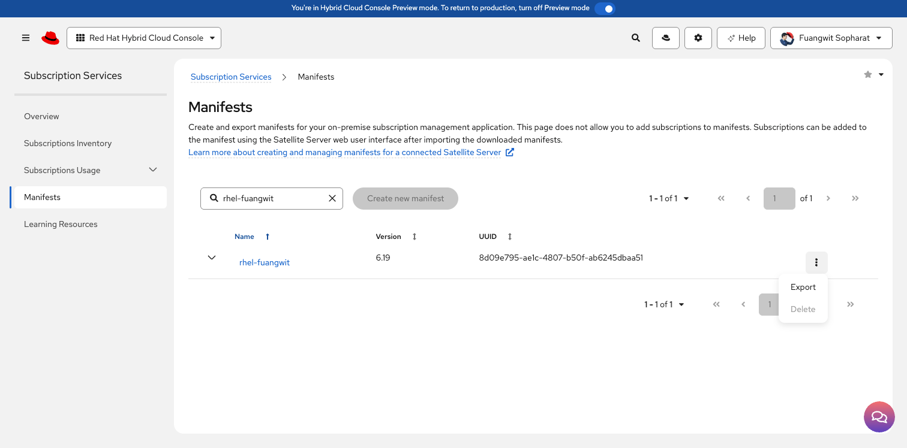

# Subscription Manifest Uploads

## Subscription Manifest Import (Phase 1.1)

This section outlines the process for creating, exporting, and importing a Red Hat Subscription Manifest. This file securely bridges the disconnected Satellite Server to the Red Hat Content Delivery Network (CDN), populating local entitlement pools for downstream managed nodes.

***

### 1. Upstream Manifest Generation & Export

Following official Red Hat guidance, manifests must be managed via the Hybrid Cloud Console prior to local ingestion.

[Obtaining a Red Hat subscription manifest](https://docs.redhat.com/en/documentation/red_hat_satellite/6.19/html-single/installing_satellite_server_in_a_connected_network_environment/index#obtaining-a-red-hat-subscription-manifest)

[Red Hat Satellite Certificate / Manifest FAQ](https://access.redhat.com/articles/229083)

[How do I get a new Red Hat Satellite Manifest?](https://access.redhat.com/solutions/11025)

#### 1.1 Allocation Strategy

1. Navigate to the **Red Hat Hybrid Cloud Console** > **Subscription Services** > **Manifests**.
2. Identify or create the dedicated subscription allocation profile matching the Satellite installation scenario.

#### 1.2 Exporting the Cryptographic Archive

1. Click the context menu (three vertical dots) on the right side of the manifest row.
2. Select **Export**.
3. Download the generated encrypted `.zip` bundle to your local management workstation.

<figure><figcaption></figcaption></figure>

***

### 2. Ingesting the Manifest into Satellite Server

Once the payload archive is obtained, it must be imported into the local organization structure to unlock product entitlement tracking.

#### 2.1 Web UI Navigation Path

1. Open your web browser and navigate to the Satellite console: `https://satellite.lab.local`.
2. Authenticate using administration credentials (`admin` / `redhat`).
3. Set the global context drop-down menus to: **Organization:** `Lab_Org` | **Location:** `AWS_Region`.
4. From the left sidebar, navigate to **Content** > **Subscriptions**.

#### 2.2 Upload Execution

1. Click the **Manage Manifest** button on the top right of the Subscriptions ledger.
2. In the modal dialog window, click **Choose File** and select the exported `manifest` `.zip` archive.
3. Click **Upload** to initiate processing.

<figure><figcaption></figcaption></figure>

***

### 3. Verification & Entitlement Ledger Audit

Once processing finishes, the subscription ledger populates automatically with the corresponding product entitlements.

**Verification Milestone**

Verify via the Satellite terminal interface that the subscription allocation has bound successfully to the local organization schema:

```bash
hammer subscription list --organization "Lab_Org"
```
