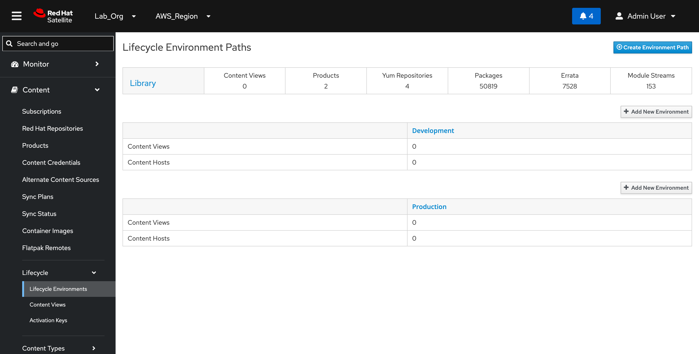
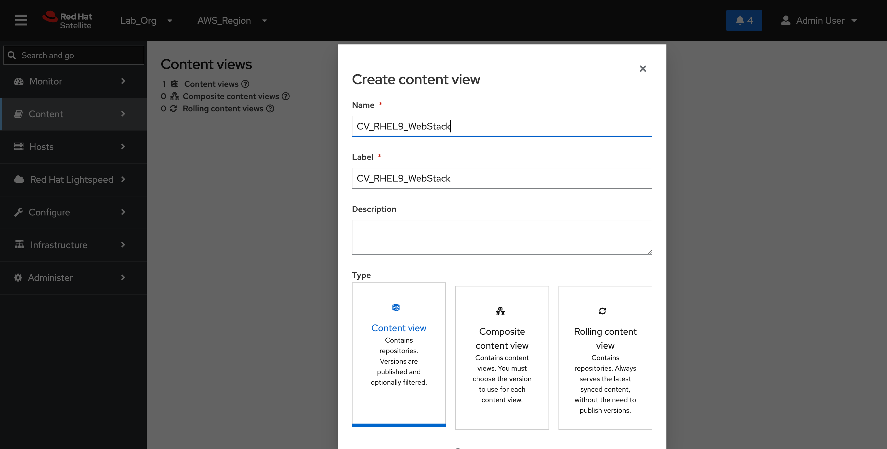
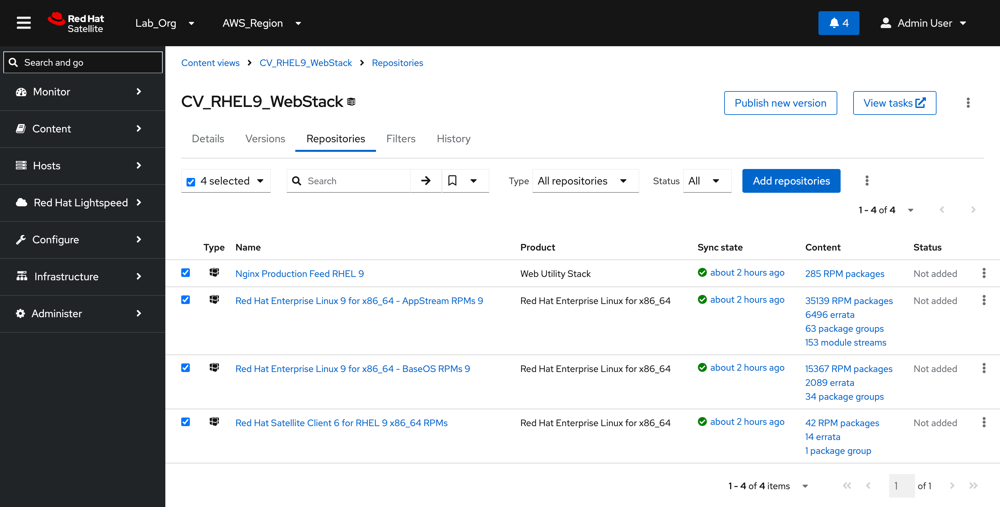
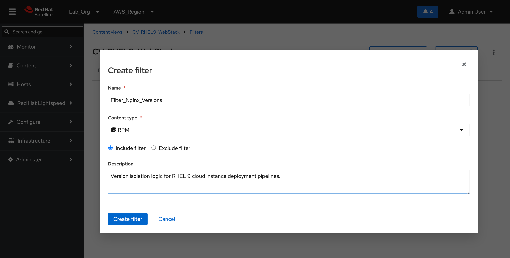
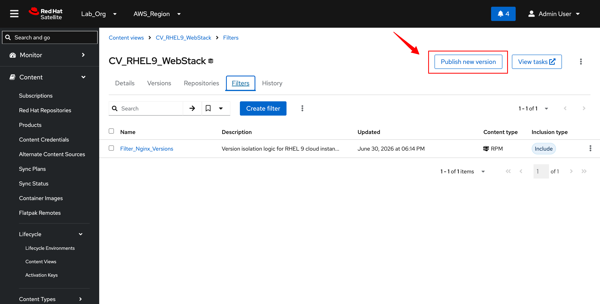
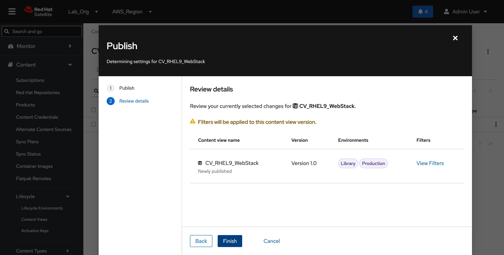
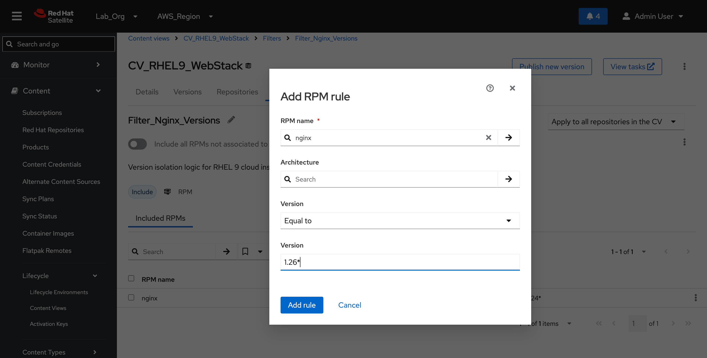
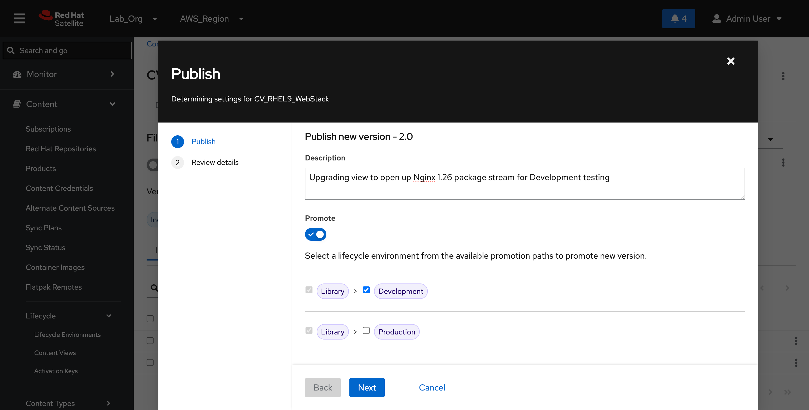
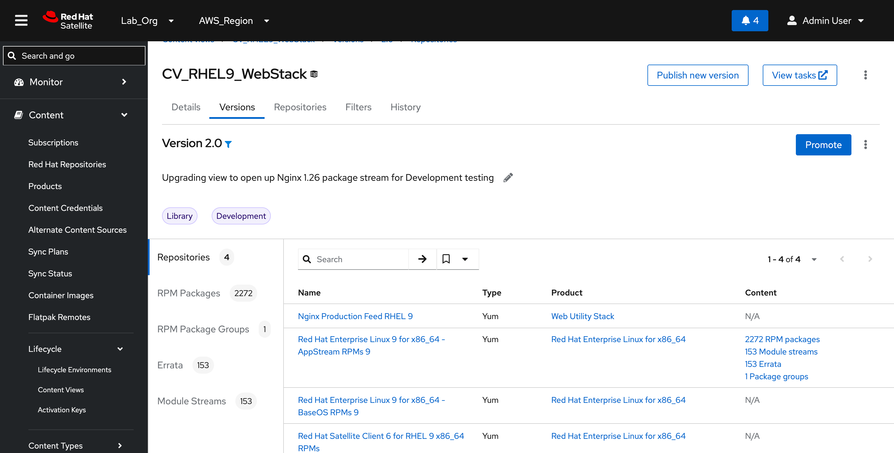

# Content Views (Nginx 1.24 vs 1.26)

#### 1. Creating the Lifecycle Environments

Before creating our Content View, we must establish our environment paths (Development and Production) to map the logical progression of our software stack.

**Web UI Execution Path**

1. Navigate to Content > Lifecycle Environments.
2. Click New Environment Path on the right side.
3. Configure the Development environment using the following parameters:
   * Name: `Development`
   * Label: `Development`
   * Description: Testing and staging environment for unstable package sets (Nginx 1.26).
4. Click Save.
5. Click Add Environment at the end of the Development track to chain the Production environment:
   * Name: `Production`
   * Label: `Production`
   * Description: Locked down, highly stable baseline environment (Nginx 1.24).
6. Click Save.

<figure><figcaption></figcaption></figure>

#### 2. Initializing the `CV_RHEL9_WebStack` Content View

With our environments configured, we will create the foundational Content View assembly engine.

**Web UI Execution Path**

1. Navigate to Content > Content Views and click Create Content View.
2. Populate the creation fields with these exact properties:
   * Name: `CV_RHEL9_WebStack`
   * Label: `CV_RHEL9_WebStack`
   * Type: `Content View` .
3. Click Save.

<figure><figcaption></figcaption></figure>

#### 3. Attaching Repository Data Streams

1. Inside the newly created `CV_RHEL9_WebStack` layout, navigate to the Repositories sub-tab.
2. Click Add Repositories.
3. Select the check boxes next to all four streams we synchronized during Step 4:
   * `Red Hat Enterprise Linux 9 for x86_64 - BaseOS RPMs 9`
   * `Red Hat Enterprise Linux 9 for x86_64 - AppStream RPMs 9`
   * `Red Hat Satellite Client 6 for RHEL 9 x86_64 RPMs`
   * `Nginx Production Feed RHEL 9`
4. Click Add Repositories to confirm integration.

<figure><figcaption></figcaption></figure>

#### 4. Implementing Content View Version Filters

To fulfill the demo narrative—ensuring `rhel9-prod` safely tracks an isolated, corporate-approved legacy web engine while `rhel9-dev` unlocks cutting-edge features—we construct an Inclusion Filter. This blocks all packages within our custom repository unless they match our explicit version constraints.

**Step 4.1: Create the Filter Container**

1. Inside your `CV_RHEL9_WebStack` dashboard view, navigate to the Filters tab.
2. Click Create Filter to initialize the wizard modal.
3. Define the configuration container fields as follows:
   * Name: `Filter_Nginx_Versions`
   * Content type: `RPM`
   * Inclusion Policy: Select the Include filter radio button (allowing only specified packages to pass).
   * Description: `Version isolation logic for RHEL 9 cloud instance deployment pipelines.`
4. Click Create filter.

<figure><figcaption></figcaption></figure>

**Step 4.2: Define the Nginx 1.24 Inclusion Rule**

1. Click on the newly created `Filter_Nginx_Versions` link to open its rules management page.
2. Under the Included RPMs section, click the blue Add RPM rule button.
3. Populate the package target parameters to explicitly isolate our initial production baseline:
   * RPM name: `nginx`
   * Architecture: _(Leave blank to allow all matching architectures)_
   * Version Operator: `Equal to`
   * Version: `1.24*`
4. Click Add rule to lock the constraint into the view pipeline.

<figure><figcaption></figcaption></figure>

**Step 4.3: Publish & Promoting Version 1.0 (Production)**

Now that your filter container holds the rule for `1.24*`, you are ready to publish Version 1.0 of the Content View!

1. Go back up to the top of the content view page or click the Versions tab.
2. Click the blue Publish new version button.
3. Name/Description it something clear like: `Publishing baseline Nginx 1.24 for Production`.
4. Once published, click Promote next to Version 1.0 and push it directly into your Production Lifecycle Environment.

<figure><figcaption></figcaption></figure>

<figure><figcaption></figcaption></figure>

**Step 4.4: Upgrading to Version 2.0 (Development Testing Track)**

To establish our agile application tier for validation testing on `rhel9-dev`, we must modify our inclusive configuration filter rules to pull the newer application packages and compile a separate snapshot layer.

1. Click back over to the **Filters** tab inside the `CV_RHEL9_WebStack` dashboard.
2. Select the `Filter_Nginx_Versions` link to access its granular rules manager ledger.
3. Under the **Included RPMs** section layout, click the blue **Add RPM rule** button.
4. Populate the package target parameters to incorporate the modern software track:
   * RPM name: `nginx`
   * Architecture: _(Leave blank)_
   * Version Operator: `Equal to`
   * Version: `1.26*`
5. Click **Add rule** to commit the parameter to the filter cache.

<figure><figcaption></figcaption></figure>

**Step 4.5: Publishing & Promoting Version 2.0**

With both version lines now indexed inside our filter blueprint, publish a fresh version slice of the view and promote it strictly to the Development lifecycle stream.

1. Navigate back to the **Versions** tab or click the **Publish new version** button at the top right of the workspace area.
2. Configure the new wizard workflow options:
   * Description: `Upgrading view to open up Nginx 1.26 package stream for Development testing`
   * Promote Switch: Toggle to **ON** (Checked).
3. Under the available promotion paths matrix layout, select **only the checkbox next to Development** (`Library > Development`). Leave the _Production_ box unchecked to completely protect your live production instance baseline.
4. Click **Next**, review the final parameter summary checklist, and complete the execution task.

<figure><figcaption></figcaption></figure>

**Verification Milestone**

Open your **Content Views > CV\_RHEL9\_WebStack > Versions** tracker screen. Audit the environment tracking blocks to prove that **Version 1.0** is mapped explicitly to **Production** while **Version 2.0** is concurrently locked to **Development**.

<figure><figcaption></figcaption></figure>
