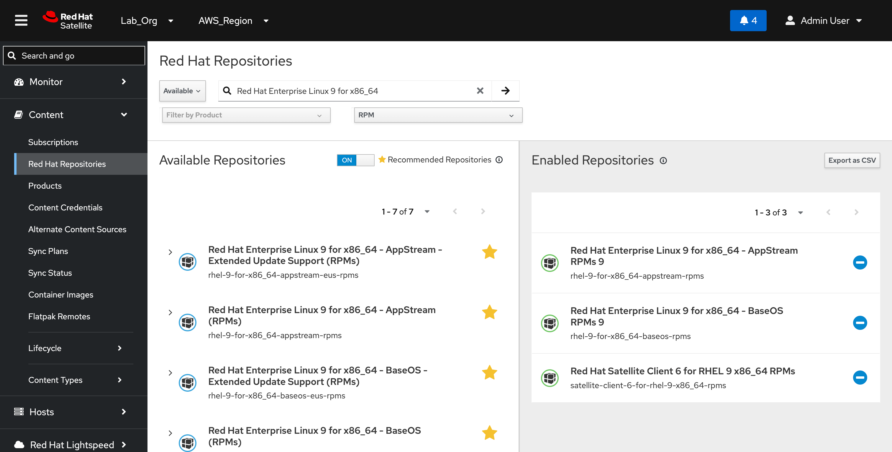
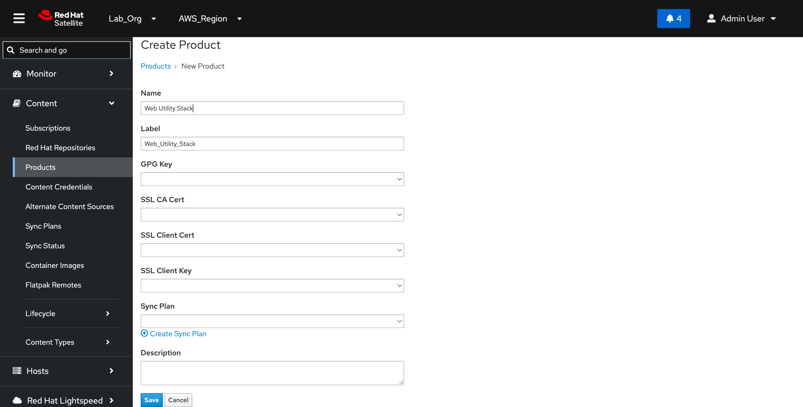
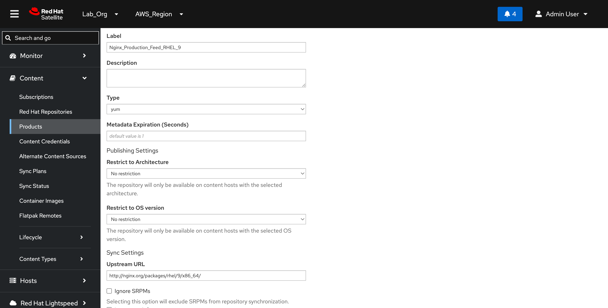
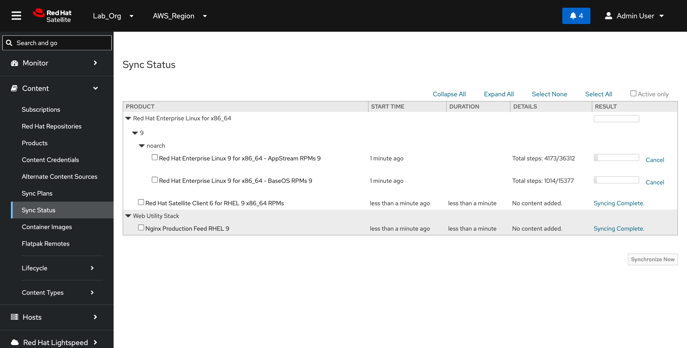

# Upstream & Custom Repositories

#### 1. Enabling Upstream Red Hat Repositories (CDN)

To properly govern, patch, and manage our target nodes, the primary Satellite instance must mirror the official Red Hat Enterprise Linux 9 repository tracks from the Red Hat Content Delivery Network (CDN).

**Web UI Execution Path**

1. Access the Satellite Web UI dashboard at `https://satellite.lab.local` and authenticate.
2. Confirm the organization controls in the top context menu match our deployment parameters: Organization: `Lab_Org` | Location: `AWS_Region`.
3. Open the left sidebar navigation tree and choose Content > Red Hat Repositories.
4. In the main search panel, filter using the string `Red Hat Enterprise Linux 9 for x86_64`.
5. Under the Available Repositories sub-pane, identify each target channel and click the blue expansion toggle (`+` icon) to move them into your working set.

Ensure all three core management repositories appear active under your Enabled Repositories sidebar ledger:

* Red Hat Enterprise Linux 9 for x86\_64 - AppStream RPMs 9 (`rhel-9-for-x86_64-appstream-rpms`)
* Red Hat Enterprise Linux 9 for x86\_64 - BaseOS RPMs 9 (`rhel-9-for-x86_64-baseos-rpms`)
* Red Hat Satellite Client 6 for RHEL 9 x86\_64 RPMs (`satellite-client-6-for-rhel-9-x86_64-rpms`)

<figure><figcaption></figcaption></figure>

#### 2. Creating the Custom "Web Utility Stack" Product

To support our multi-version demonstration narrative, we must construct a custom product container to house our proxy-whitelisted third-party Nginx software track.

**Step 2.1: Initialize the Custom Product Container**

1. Open the left sidebar navigation menu and select Content > Products.
2. Click the Create Product button in the top right corner.
3. Configure the following parameter definitions exactly as shown below:
   * Name: `Web Utility Stack`
   * Label: `Web_Utility_Stack`
   * GPG Key / SSL Configuration Fields: _(Leave blank for this sandbox evaluation environment)_
4. Click Save.

<figure><figcaption></figcaption></figure>

**Step 2.2: Establish the Custom Nginx Repository**

1. Once saved, you will automatically transition to the product configuration layout. Click the Repositories tab, then click New Repository.
2. Populate the creation fields with the following infrastructure coordinates:
   * Name: `Nginx Production Feed RHEL 9`
   * Label: `Nginx_Production_Feed_RHEL_9`
   * Type: `yum`
   * Upstream URL: `http://nginx.org/packages/rhel/9/x86_64/`
   * Download Policy: `On Demand` _(Optimizes storage by downloading metadata instantly, pulling complete packages only when explicitly requested by a node)_
3. Click Save.

<figure><figcaption></figcaption></figure>

<figure><figcaption></figcaption></figure>

#### 3. Initial Repository Synchronization Execution

With both upstream channels and the custom web stack defined, trigger an initial data synchronization loop to populate the platform tracking matrix.

1. Navigate to Content > Sync Status.
2. Click to expand Red Hat Enterprise Linux Server and Web Utility Stack.
3. Select the checkboxes next to all four enabled repository tracks:
   * `Red Hat Enterprise Linux 9 for x86_64 - AppStream RPMs 9`
   * `Red Hat Enterprise Linux 9 for x86_64 - BaseOS RPMs 9`
   * `Red Hat Satellite Client 6 for RHEL 9 x86_64 RPMs`
   * `Nginx Production Feed RHEL 9`
4. Click Synchronize Now to execute the background download tasks concurrently.

<figure><figcaption></figcaption></figure>
